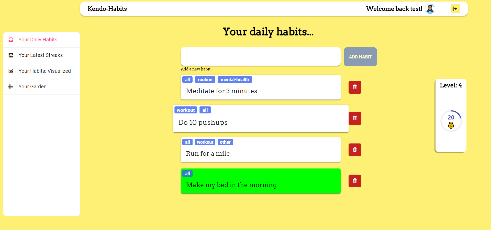
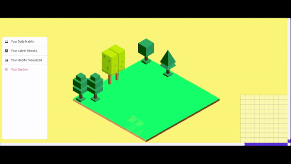
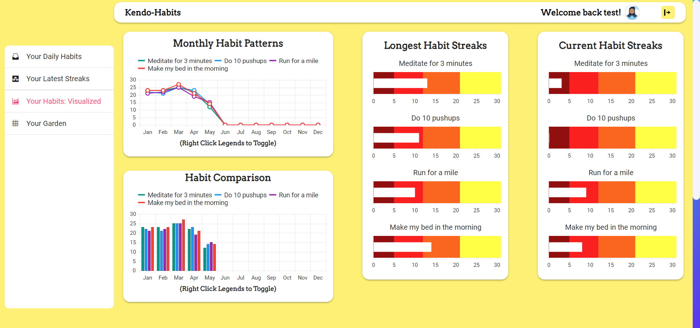
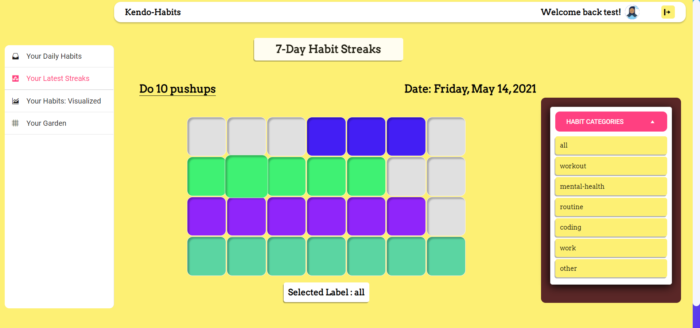

# Kendo Habits | Submitted to Progress Worthy Web App Hackathon 2021

Build great habits, while having fun!

Kendo Habits is a gamified Habit Builder built with React, the Kendo React UI Library and of-course ❤️!

## DEMO Video on YouTube (Click on picture below)

## [Devpost Link](https://devpost.com/software/kendo-habits-sylh2u)

## Inspiration

"You do not rise to the level of your goals, you fall to the level of your systems"
 
"Every action you take is a vote for the type of person you wish to become". 

These quotes from my recent read, "Atomic Habits" by James Clear, really struck a chord with me. It gave me the vision to build a system that helps people progress towards their ideal self. The vision to build an enjoyable system that celebrates even the smallest wins (a significant win, nonetheless). Kendo Habits was born.

## What it does

"Kendo Habits" makes habit-building enjoyable, automated, and easy! It gives you both visual and auditory feedback for every habit you complete. Not only do you earn "Kendo XP" 💰 and level up, with all the progress you make, but you also get rewarded with pretty trees to customize your virtual garden with beautiful plants and trees.

 
The beauty of your garden is a direct reflection of all the work you've put into yourself in real life. The more habits you complete, the better your garden starts to look, and before you know it, these new habits have become your new identity! Congratulations!

  

What's more, you get to keep track of your habit streaks, and your true habit patterns with the beautiful UI components and charts from Kendo-React. All you have to do is focus on checking off that habit and we'll automate the rest! Gone are the days of misplacing books, or loose sheets of paper where you meticulously kept track of your habits. Kendo Habits to the rescue!

## How is Kendo-Habits contributing to a good cause?

Change starts with the individual. The individual wants to succeed. The individual wants to make their mark on the world! And it all starts with a habit - perhaps even a trivial one. The thing about habits is that it has this [snowball effect](https://greatergood.berkeley.edu/article/item/the_snowball_effect_practice_one_happiness_habit_and_the_others_will_follow) - you improve other areas of your life - you start becoming the person you want to be. Now that person could be an amazing teacher, doctor, or perhaps even the Chief Officer of an NGO, touching the lives of thousands of people positively. Kendo-Habits helps people achieve their true potential, and produce more of such people. The secret to success is not an infinite well of willpower - it is small consistent habits done for so long, that it becomes your identity.

## How I built it

The entire app was built with React, powered by Kendo React components on the front-end, and Firebase in the backend for real-time updates of your habits.

## Challenges I ran into

Incorporating real-time updates to work with firebase and react, when the user updates their habit description, habit labels, or habit completion was quite challenging for someone like me who didn't know anything about react until late April of this year. And getting habit completion data to reflect in the "habit streaks" page and the "habit charts" page was a handful, to say the least.

The virtual garden in particular was very challenging. Giving the user a way to customize their garden in an intuitive, but fault-tolerant way seemed to be an insurmountable task. However, the intuitive nature of KendoReact's components allowed me to focus on the features of my project. I never felt like I was juggling two things at a time - for instance, I could focus on making the virtual garden work because of the out-of-the-box Navigation Panel that KendoReact provides.

## Accomplishments that I'm proud of

Real-time updates with firebase for almost everything you do in Kendo Habits, is something I'm really happy about. Working out math with dates in order to update the Kendo React charts was also a great learning opportunity. This process of handling math with dates was definitely alleviated by the "Date Math" functions that come with KendoReact.

Getting the virtual garden to work was a truly rewarding experience. I definitely had to get my creative juices flowing to come up with the idea of using a mini-version of the garden to control any tree in the bigger, more visually appealing garden. And finally, I'm really happy with the end result of actually drawing the different trees and garden tiles (or assets) by myself in Inkscape.

## What I learned

I learned that creating web apps can be much more enjoyable than usual when you have libraries like KendoReact that provide building blocks common to several apps - navigation, side-panels, app-bars, charts, and the like, to name a few.

## What's next for Kendo Habits

Look forward to growing Kendo Habits into something much bigger, according to how people respond. I personally would love to add more types of "garden items" to the virtual garden, because I enjoy the process of creating visual assets in software like Inkscape.

